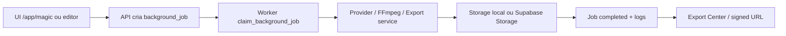

# Auditoria Tecnica Completa - Video Flow / Content Engine AI

Data da auditoria: 2026-06-10

Escopo: analise estatica do repositorio local em `C:\Users\dmooo\OneDrive\Desktop\CODEX\Video Flow`, sem refatoracao e sem criacao de funcionalidades. Nao houve conexao real com Supabase remoto, Storage remoto ou providers externos; portanto buckets, objetos orfaos reais e dados vivos nao foram inspecionados em runtime.

## Sumario executivo

O projeto tem uma base ampla e visualmente completa para um SaaS de video/conteudo, com Next.js 15, TypeScript, Tailwind, shadcn-like components, Supabase schema, RLS, workers, filas, providers, export ZIP e FFmpeg. A arquitetura esta bem encaminhada, mas o estado real ainda e hibrido: muitas telas e varias APIs continuam consumindo `src/lib/mock-data.ts`, enquanto algumas camadas recentes ja migraram para jobs, providers estritos, FFmpeg e Storage privado quando `SUPABASE_SERVICE_ROLE_KEY` existe.

Ponto mais importante: a interface parece mais madura que a persistencia real. O sistema compila e tem caminhos reais para render/export/providers, mas ainda nao esta pronto para producao comercial porque autenticacao/permissions nao protegem a maioria das API routes, billing usa mocks para liberar uso, e grande parte do produto opera em memoria/local mock.

Ultima validacao executada nesta sessao antes desta auditoria:

- `npm.cmd run typecheck`: passou.
- `npm.cmd run build`: passou, com 134 rotas geradas no build.

## Metricas gerais

| Item | Quantidade aproximada | Observacao |
|---|---:|---|
| Arquivos em `src` | 271 | App amplo, muitos modulos de produto. |
| Paginas `page.tsx` | 110 | Build listou 134 rotas totais, contando dinamicas e APIs. |
| API routes | 34 | Quase todas sem checagem explicita de sessao no handler. |
| Componentes | 58 | Muitos componentes grandes de modulo, varios alimentados por mock-data. |
| Worker handlers | 11 | Jobs principais existem; alguns reais, alguns guardados/mock. |
| Tabelas SQL declaradas | 120 | Inclui schema principal e migrations R5/R6. |
| Indices SQL | 130 | Cobertura boa por workspace/status, mas nao validada em plano real de queries. |
| Foreign keys/references | 241 | Modelo relacional amplo. |
| Policies RLS | 253 | Schema tem RLS forte, mas rotas server-side podem bypassar se usarem service role sem auth. |
| Providers configurados em codigo | 10+ | OpenAI Text/TTS/Images, ElevenLabs, Pexels/Pixabay/Unsplash, Runway/Kling/Pika/Veo/Luma preparados. |

## 1. Arquitetura geral

### Frontend

- Next.js App Router em `src/app`.
- Layout principal em `src/app/(app)/layout.tsx`.
- Sidebar/header em `src/components/app-sidebar.tsx` e `src/components/app-header.tsx`.
- UI baseada em componentes locais `src/components/ui/*`.
- React Query esta instalado e o `QueryClientProvider` existe em `src/components/providers.tsx`, mas nao ha uso real de `useQuery`/`useMutation` nos modulos analisados. Grande parte da UI ainda usa estado local e `mock-data`.

### Backend

- API routes em `src/app/api/*`.
- Rotas recentes de providers e media passam por backend, o que evita exposicao de chaves no frontend.
- Varias APIs ainda usam `mock-data` diretamente e aceitam `workspace_id`/`user_id` do body.
- Nao existe `middleware.ts` para proteger `/app/*` ou `/api/*`.
- Nao foram encontrados `auth.getUser()` ou validacao explicita de sessao nas rotas `/api/*`.

### Workers e filas

- `src/lib/jobs/job-queue.ts` escolhe entre backend local `.data/background-jobs.json` e Supabase.
- `src/lib/jobs/supabase-job-queue.ts` usa `background_jobs`, `background_job_logs` e `worker_heartbeats`.
- `src/workers/runner.ts` roteia para handlers por tipo.
- Existem handlers para `magic_video`, `ai_generation`, `tts_generation`, `image_generation`, `render_video`, `export_package`, `viral_clip`, `text_to_video`, `image_to_video`, `talking_character`, `backup`, `factory_generation`.

### Providers

- Providers novos/estritos em `src/lib/providers/*`.
- Ha tambem providers antigos em `src/lib/ai/*`, criando duplicidade.
- OpenAI Text/TTS/Images podem ser reais com `OPENAI_API_KEY`.
- ElevenLabs pode ser real com `ELEVENLABS_API_KEY`.
- Video providers tem status/env configurado, mas adapters HTTP reais ainda nao foram implementados.

### Storage

- `src/lib/storage/media-storage.ts` suporta buckets privados `videos`, `thumbnails`, `exports`, `audio`, `images`, `temp`.
- Upload/download/signed URL existem quando Supabase admin esta configurado.
- Sem service role, export/render caem em arquivos locais `public/renders`, `public/thumbnails`, `public/exports`.

### Billing

- `src/lib/billing.ts` ainda usa `mock-data` para plano, wallet, usage e feature flags.
- `src/lib/billing/credit-ledger.ts` implementa reserva/settlement real via RPC Supabase, mas so funciona com Supabase admin configurado.
- Risco atual: a decisao de liberar uso e mockada, enquanto a reserva real so ocorre no backend Supabase.

### Fluxo principal real previsto

### Fluxo real atual

- Para render/export: caminho real existe, mas depende de FFmpeg, assets existentes e worker rodando.
- Para IA texto/imagem/TTS: caminho real existe, mas depende de chaves e fallback explicitamente bloqueado por padrao nas rotas novas.
- Para Magic, Viral Clips, Factories, Channels e Analytics: grande parte ainda e mock/hibrida.

## 2. Banco de dados

### Diagnostico geral

- O schema e ambicioso e cobre praticamente todas as fases.
- RLS esta habilitado em grande escala.
- Muitos objetos SQL representam contratos futuros, mas nao estao conectados a persistencia real da UI.
- Existem tabelas duplicadas/conflitantes conceitualmente:
  - `video_ai_providers` e `ai_video_providers`.
  - `ai_generation_jobs`, `magic_video_jobs`, `factory_queue_jobs`, `background_jobs` podem representar filas paralelas.
  - `media_assets`, `assets`, `ai_video_assets` sao bibliotecas parecidas com responsabilidades sobrepostas.
  - `audio_generations`, `image_generations`, `thumbnail_generations`, `media_usage_logs`, `provider_usage_logs` se sobrepoem em auditoria de consumo.
- `provider_usage_logs` aparece em R5 e R6. `create table if not exists` evita falha, mas as policies de insert ficam redundantes (`service writers provider usage logs` e `content creators write provider usage logs`).

### Tabelas por uso aproximado

Legenda de status:

- `Ativa`: existe uso real em service/API/worker, ainda que condicionado a env.
- `Parcial`: schema/UI existe, mas persistencia real nao e dominante.
- `Mock`: tela/fluxo usa `mock-data` ou memoria local.
- `Orfa`: sem referencia relevante fora do schema ou so citada em docs.

Risco de remocao: risco de quebrar produto se remover agora.

| Tabela | Finalidade | Status | Refs aprox. | Risco remocao | Inconsistencia/observacao |
|---|---|---:|---:|---|---|
| user_profiles | Perfil de usuario | Parcial | 3 | Medio | Auth existe, UI ainda pouco conectada. |
| workspaces | Tenant principal | Parcial | 34 | Alto | Base multi-tenant; switcher usa mock-data. |
| roles | RBAC | Parcial | 9 | Alto | Policies dependem; UI/permissoes ainda parcial. |
| permissions | Permissoes granulares | Parcial | 19 | Alto | RLS usa permissoes, mas APIs nao validam sessao. |
| role_permissions | Vinculo role/permissao | Parcial | 2 | Alto | Baixo uso direto no app. |
| workspace_users | Membros workspace | Parcial | 5 | Alto | Essencial para RLS; pouco usado no frontend. |
| audit_logs | Auditoria | Parcial | 10 | Medio | `registerAuditLog` so faz `console.info`. |
| projects | Projetos de conteudo | Parcial | 78 | Alto | UI usa mock/local state. |
| niches | Nichos | Parcial | 22 | Medio | UI mockada. |
| personas | Personas | Parcial | 29 | Medio | UI mockada. |
| keywords | Palavras-chave | Parcial | 20 | Medio | UI mockada. |
| tags | Tags globais | Parcial | 107 | Alto | Muito referenciada em tipos/mocks. |
| content_folders | Pastas | Mock | 4 | Medio | Organizador visual com mock. |
| content_items | Biblioteca central | Parcial | 8 | Alto | Contrato importante, sem CRUD real completo. |
| content_item_tags | M:N tags/conteudo | Parcial | 4 | Medio | Baixo uso direto. |
| favorites | Favoritos | Mock | 28 | Medio | UI mockada. |
| trends | Tendencias fase 3 | Mock | 22 | Baixo | Possivel sobreposicao com `trend_topics`. |
| competitors | Concorrentes | Mock | 13 | Medio | Usado por UI mock. |
| competitor_insights | Insights concorrentes | Mock | 3 | Baixo | Pouco referenciado. |
| content_ideas | Ideias | Mock | 3 | Medio | Pode se sobrepor a `idea_bank`. |
| idea_scores | Scores de ideias | Mock | 4 | Baixo | Pouco uso real. |
| idea_sources | Fontes de ideias | Mock | 4 | Baixo | Pouco uso real. |
| idea_events | Eventos de ideia | Mock | 4 | Baixo | Pouco uso real. |
| ai_providers | Providers IA configuraveis | Parcial | 5 | Medio | Tela nova usa env/status, nao tabela. |
| prompt_templates | Prompt engine | Parcial | 2 | Medio | Sem CRUD real completo. |
| ai_generations | Logs IA | Parcial | 4 | Medio | Workers logam provider_usage, nao necessariamente esta tabela. |
| ai_generation_jobs | Fila IA antiga | Parcial | 2 | Baixo | Sobreposta por `background_jobs`. |
| ai_agents | Agentes | Mock | 2 | Medio | Playground/agentes parcialmente visuais. |
| playground_messages | Historico playground | Mock | 2 | Baixo | Sem persistencia real. |
| ai_credit_usage | Creditos IA antigo | Parcial | 2 | Baixo | Sobreposto por media/provider/credit transactions. |
| voice_providers | Providers voz | Mock | 2 | Baixo | Tela antiga usa mock. |
| voices | Vozes | Mock | 30 | Medio | Biblioteca de vozes em mock-data. |
| audio_generations | Geracoes de audio | Parcial | 3 | Medio | TTS real nao persiste aqui por padrao. |
| image_providers | Providers imagem | Mock | 2 | Baixo | Tela antiga mockada. |
| image_generations | Geracoes imagem | Parcial | 3 | Medio | Provider real loga media/provider, nao esta tabela. |
| media_assets | Midia fase 5 | Parcial | 2 | Alto | Render usa mock `mediaAssets`. |
| video_projects | Projetos de video | Parcial | 4 | Alto | Render/export dependem, mas fonte ainda mock-data. |
| video_scenes | Cenas de video | Parcial | 3 | Alto | FFmpeg renderer usa mock-data. |
| subtitle_segments | Legendas | Parcial | 3 | Medio | Renderer usa mock; editor visual. |
| music_tracks | Trilhas | Mock | 2 | Baixo | Biblioteca mock. |
| video_renders | Renders | Parcial | 4 | Alto | Existe registry local; persistencia DB nao fechada. |
| media_usage_logs | Consumo midia | Ativa parcial | 12 | Alto | Usada por ledger quando Supabase admin existe. |
| visual_style_presets | Presets visuais | Mock | 2 | Baixo | UI Magic usa mock. |
| video_effects | Efeitos | Mock | 2 | Baixo | Editor visual. |
| video_ai_providers | Providers video antigos | Mock | 2 | Baixo | Duplicada com `ai_video_providers`. |
| image_animations | Animacoes imagem | Mock | 2 | Baixo | Sem worker real. |
| subtitle_styles | Estilos legenda | Mock | 2 | Baixo | Visual. |
| audio_settings | Config audio | Parcial | 3 | Medio | Renderer consulta mock. |
| thumbnail_generations | Thumbnails | Parcial | 2 | Medio | Export usa mock-data e real fallback. |
| video_versions | Versoes video | Mock | 3 | Baixo | Comparacao visual. |
| magic_templates | Templates Magic | Mock | 2 | Medio | UI Magic usa mock. |
| magic_video_jobs | Jobs Magic antigos | Mock | 3 | Baixo | Sobreposto por `background_jobs`. |
| source_videos | Videos fonte | Mock | 3 | Medio | Viral clips mock. |
| video_transcripts | Transcricoes | Mock | 3 | Medio | Whisper real nao implementado. |
| viral_clip_jobs | Jobs cortes | Mock | 2 | Medio | API usa mock-data. |
| viral_moments | Momentos virais | Mock | 2 | Medio | API render de corte mock. |
| viral_clips | Cortes virais | Mock | 10 | Medio | Biblioteca mock. |
| channels | Canais | Mock | 90 | Alto | Muitas telas dependem; sem persistencia real dominante. |
| channel_templates | Templates canal | Mock | 2 | Medio | UI operacional mock. |
| content_calendar | Calendario | Mock | 2 | Baixo | Visual. |
| production_plans | Planos producao | Mock | 2 | Baixo | Visual. |
| bulk_jobs | Jobs em massa | Mock | 2 | Baixo | Sem fila real. |
| channel_goals | Metas canal | Mock | 2 | Baixo | Visual. |
| channel_permissions | Permissoes canal | Mock | 3 | Medio | Nao aplicada em APIs. |
| operation_notifications | Notificacoes | Mock | 2 | Baixo | Visual. |
| ai_video_providers | Providers AI video | Mock/Parcial | 2 | Medio | Duplicada com `video_ai_providers`; adapters pendentes. |
| image_to_video_jobs | Jobs image-to-video | Mock | 3 | Medio | API antiga usa mock pipeline. |
| text_to_video_jobs | Jobs text-to-video | Mock | 3 | Medio | API antiga usa mock pipeline. |
| intro_outro_generations | Intro/outro | Mock | 3 | Baixo | Placeholder. |
| talking_character_jobs | Personagem falante | Mock | 3 | Medio | Provider real nao implementado. |
| ai_video_assets | Biblioteca video IA | Mock | 2 | Medio | Usa mock render MP4. |
| plans | Planos billing | Mock | 6 | Alto | Billing real nao conectado. |
| subscriptions | Assinaturas | Mock | 7 | Alto | `canUseFeature` usa mock-data. |
| credit_wallets | Carteira creditos | Parcial | 3 | Alto | Ledger real usa Supabase; decisao ainda mock. |
| credit_transactions | Transacoes | Parcial | 6 | Alto | Reserva/settle real via RPC. |
| credit_packages | Pacotes creditos | Mock | 1 | Baixo | Checkout placeholder. |
| billing_events | Eventos billing | Mock | 3 | Medio | Provider `placeholder`. |
| invoices | Faturas | Mock | 5 | Baixo | Visual. |
| platform_admins | Admins plataforma | Parcial | 1 | Alto | Usado em RLS, pouco usado no app. |
| feature_flags | Flags | Mock | 1 | Medio | `canUseFeature` usa mock-data. |
| export_packages | Pacotes export | Parcial | 3 | Alto | Service retorna objeto, mas persistencia DB incompleta. |
| video_metadata | Metadados video | Parcial | 1 | Medio | Export usa mock-data/generated. |
| bulk_export_jobs | Export lote | Parcial | 3 | Medio | Worker cria ZIP, tabela pouco usada. |
| manual_publications | Publicacao manual | Mock | 2 | Medio | Export Center historico mock. |
| asset_sources | Fontes asset | Mock | 1 | Baixo | Pexels/Pixabay/Unsplash preparados. |
| assets | Asset library nova | Mock/Parcial | 80 | Alto | API upload ainda demo; sobrepoe media_assets. |
| asset_collections | Colecoes asset | Mock | 1 | Baixo | Visual. |
| asset_collection_items | Items colecao | Orfa | 1 | Baixo | Sem fluxo real. |
| asset_usage | Uso de assets | Mock | 6 | Medio | Sem rastreio real completo. |
| asset_search_cache | Cache busca asset | Mock | 1 | Baixo | Sem provider real ativo. |
| premium_templates | Templates premium | Mock | 1 | Alto | UI templates depende de mock-data. |
| template_packs | Pacotes template | Mock | 2 | Medio | Visual. |
| template_pack_items | Itens pack | Orfa | 1 | Baixo | Baixo uso. |
| onboarding_progress | Onboarding | Parcial | 2 | Medio | API events demo; progresso visual. |
| onboarding_events | Eventos onboarding | Parcial | 1 | Baixo | API retorna demo. |
| video_quality_scores | Score qualidade | Mock/Parcial | 1 | Medio | API analyze calcula sem persistir real. |
| video_recommendations | Recomendacoes | Mock/Parcial | 1 | Medio | UI usa mock-data. |
| trend_topics | Topicos tendencia | Mock | 1 | Baixo | Sobrepoe `trends`. |
| idea_bank | Banco ideias | Mock | 5 | Medio | Sobrepoe `content_ideas`. |
| tracked_channels | Concorrentes canais | Mock | 1 | Baixo | Estrutura futura. |
| content_factories | Factories | Mock/Parcial | 2 | Medio | API generate internal_mock. |
| production_rules | Regras factory | Mock | 2 | Baixo | Sem executor real. |
| factory_schedules | Agendas factory | Mock | 2 | Baixo | Sem scheduler real. |
| content_series | Series | Orfa | 1 | Baixo | Sem fluxo real. |
| factory_queue_jobs | Queue factory | Mock | 1 | Medio | Sobreposta por background_jobs. |
| review_queue_items | Revisao factory | Mock | 2 | Medio | Visual. |
| factory_alerts | Alertas factory | Mock | 1 | Baixo | Visual. |
| backup_jobs | Backups | Mock/Parcial | 1 | Medio | Handler retorna not_configured. |
| data_retention_policies | Retencao | Mock | 1 | Baixo | Visual/admin. |
| security_events | Eventos seguranca | Mock | 1 | Medio | Sem captura real. |
| rate_limits | Rate limit | Mock | 1 | Alto | Tabela existe, enforcement ausente. |
| error_logs | Logs erro | Mock | 1 | Medio | Sem captura global. |
| user_legal_acceptances | Aceites legais | Mock | 2 | Medio | Pages legal placeholder. |
| data_requests | LGPD requests | Mock | 1 | Baixo | Visual. |
| smoke_test_video_results | Smoke test | Orfa | 0 | Baixo | Relatorio existe em mock-data, tabela sem uso. |
| background_jobs | Fila real | Ativa | n/a | Alto | Ativa quando Supabase admin existe; fallback local fora DB. |
| background_job_logs | Logs jobs | Ativa | n/a | Alto | Ativa quando Supabase admin existe. |
| worker_heartbeats | Heartbeat workers | Ativa | n/a | Alto | Ativa quando Supabase admin existe. |
| provider_usage_logs | Uso providers | Ativa parcial | n/a | Alto | Duplicada em R5/R6; policies redundantes. |

### Migrations conflitantes ou frageis

- `provider_usage_logs` e definida em R5 e R6. Nao deve quebrar por `if not exists`, mas deixa historico confuso.
- R5 adiciona `alter publication supabase_realtime add table ...` sem bloco idempotente para as tabelas de jobs. Em banco recriado limpo funciona; em ambiente onde publication ja tenha essas tabelas, pode falhar.
- R6 protege apenas `provider_usage_logs` contra `duplicate_object` na publication.
- A migration R5 altera constraints de `media_usage_logs.action_type`; a R6 altera de novo adicionando `thumbnail_generation` e `video_ai_generation`. Isso e funcional, mas evidencia evolucao incremental sem consolidacao.

## 3. APIs

Diagnostico geral: foram encontradas 34 API routes. Nenhuma rota analisada tem validacao explicita de usuario via `auth.getUser()` ou helper de sessao. Varias aceitam `workspace_id` e `user_id` vindos do body. Isso e risco critico para producao.

| Rota | Finalidade | Status | Usada | Protegida | Observacao |
|---|---|---|---|---|---|
| `/api/ai/generate` | Geracao OpenAI generica | Parcial/real | Sim | Nao | Precisa revisar se usa provider antigo. |
| `/api/ai/images` | Imagens IA | Real estrito | Sim | Nao | Provider falha sem key; bom, mas sem auth. |
| `/api/ai/text` | Texto IA | Real estrito | Sim | Nao | Provider falha sem key; sem auth. |
| `/api/ai/tts` | Audio IA | Real estrito | Sim | Nao | Sem auth; usa provider router. |
| `/api/ai-video/jobs` | Jobs video IA antigos | Mock | Sim | Nao | Usa `mock-data` e pipeline placeholder. |
| `/api/assets/import` | Import asset | Parcial/mock | Sim | Nao | Precisa persistencia/storage real. |
| `/api/assets/search` | Busca assets externos | Parcial | Sim | Nao | Providers externos preparados; risco sem rate limit. |
| `/api/assets/upload` | Upload assets | Demo | Sim | Nao | Retorna provider_mode demo e URLs mock se nao receber file_url. |
| `/api/export/package` | Enfileira export ZIP | Parcial/real | Sim | Nao | Usa job queue; billing mock na liberacao. |
| `/api/export/packages` | Lista historico export | Mock | Sim | Nao | Usa `mock-data`. |
| `/api/factories/generate` | Factory generation | Mock | Sim | Nao | `provider_mode: internal_mock`. |
| `/api/jobs` | Lista/cria jobs | Parcial/real | Sim | Nao | Sem auth; exposto. |
| `/api/jobs/[id]` | Detalhe job | Parcial/real | Sim | Nao | Sem checar workspace do usuario. |
| `/api/jobs/[id]/cancel` | Cancela job | Parcial/real | Sim | Nao | Risco: qualquer caller cancela job se souber id. |
| `/api/jobs/[id]/retry` | Retry job | Parcial/real | Sim | Nao | Risco: reprocessamento indevido. |
| `/api/jobs/process-next` | Processa proximo job | Dev/real | Sim | Nao | Critico: endpoint publico poderia executar worker. |
| `/api/magic/jobs` | Magic jobs antigos | Mock | Sim | Nao | Usa `magicVideoJobs` mock. |
| `/api/magic/jobs/[id]` | Detalhe Magic | Mock | Sim | Nao | Usa mock. |
| `/api/media/images` | Imagem media | Real estrito | Sim | Nao | Sem auth/rate limit. |
| `/api/media/render` | Enfileira render | Parcial/real | Sim | Nao | Duplica `/api/render/video`. |
| `/api/media/thumbnails` | Thumbnail real | Parcial/real | Sim | Nao | IA ou frame, mas sem auth. |
| `/api/media/tts` | TTS media | Real estrito | Sim | Nao | Duplica `/api/ai/tts`. |
| `/api/onboarding/events` | Eventos onboarding | Demo | Sim | Nao | Sem persistencia real. |
| `/api/providers/elevenlabs/voices` | Lista vozes ElevenLabs | Parcial/real | Sim | Nao | Retorna mock se key ausente. |
| `/api/providers/status` | Status providers | Real | Sim | Nao | Nao expoe chave, mas endpoint aberto informa configuracao. |
| `/api/providers/test` | Teste provider | Real/parcial | Sim | Nao | Risco alto: pode consumir creditos/API externa sem auth. |
| `/api/quality/analyze` | Analise qualidade | Mock/hibrida | Sim | Nao | `ai_demo`/`free_simple`, sem persistencia. |
| `/api/render/video` | Enfileira render | Parcial/real | Sim | Nao | Duplica `/api/media/render`. |
| `/api/storage/signed-url` | Signed URL Storage | Real | Sim | Nao | Critico: gera signed URL sem autenticar usuario/workspace. |
| `/api/studio/strategy` | Strategist | Mock | Sim | Nao | `internal_mock`. |
| `/api/templates/use` | Acoes templates | Demo | Sim | Nao | Sem persistencia real. |
| `/api/viral-clips/jobs` | Criar corte viral | Mock | Sim | Nao | Usa mock pipeline seguro. |
| `/api/viral-clips/jobs/[id]` | Detalhe corte viral | Mock | Sim | Nao | Usa mock-data. |
| `/api/viral-clips/jobs/[id]/render` | Render clip | Mock | Sim | Nao | Retorna `/media/mock-render.mp4`. |

Endpoints duplicados:

- `/api/media/render` e `/api/render/video`.
- `/api/media/tts` e `/api/ai/tts`.
- `/api/ai/images` e `/api/media/images`.
- Fila especifica `magic_video_jobs`/`viral_clip_jobs` em schema vs `background_jobs` generica.

## 4. Workers e Jobs

### O que esta bom

- Existe lock por `locked_at`, `locked_by`, `lock_expired_at`.
- RPC `claim_background_job` usa `for update skip locked`, bom para concorrencia.
- Retry e backoff existem.
- Cancelamento existe por `cancel_requested`.
- Heartbeat existe em `worker_heartbeats`.
- Recuperacao de stuck jobs existe.

### Riscos

- Fallback local `.data/background-jobs.json` nao e distribuido, nao e duravel para producao e nao suporta multiplas instancias.
- `process-next` via API esta aberto e pode executar jobs sem autenticacao.
- Cancel/retry abertos podem manipular jobs alheios.
- Alguns handlers ainda concluem como mock/placeholder:
  - `viral-clip.ts`: `mock_guarded`.
  - `factory-generation.ts`: motor interno/mock.
  - `backup.ts`: `not_configured`.
  - `ai-video.ts`: falha claramente se provider video nao tiver adapter, o que e correto para nao fingir sucesso.
- Magic handler precisa ser revisto porque o pipeline de Magic ainda usa base mock.

## 5. Storage

### Implementado

- Buckets privados previstos: `videos`, `thumbnails`, `exports`, `audio`, `images`, `temp`.
- Upload/download/delete/signed URL em `media-storage.ts`.
- Export Center usa signed URL para `supabase://`.
- Render e export podem enviar artefatos para Supabase Storage se service role estiver configurada.

### Riscos

- `/api/storage/signed-url` nao autentica usuario nem valida membership antes de assinar URL.
- Policy de storage usa `(storage.foldername(name))[1]::uuid`; se o object path nao comecar com UUID real de workspace, a policy falha ou nao protege como esperado.
- Sem conexao real ao Supabase nao foi possivel listar arquivos orfaos.
- Fallback local em `public/exports`, `public/renders`, `public/thumbnails` nao serve para producao multi-instancia.
- `assets/upload` ainda e demo e pode retornar mock thumbnail.

## 6. Creditos e Billing

### Implementado

- `canUseFeature` calcula permissao por plano, uso, flags e saldo.
- `reserve_credits_for_job` e `settle_reserved_credits_for_job` existem na migration R5.
- `credit-ledger.ts` registra `media_usage_logs` e `provider_usage_logs`.

### Riscos

- `canUseFeature` usa `mock-data`; portanto o bloqueio de creditos em runtime nao consulta saldo real.
- API routes confiam em `workspace_id` enviado pelo body.
- Em backend local, `reserveCreditsForJob` e `settleReservedCreditsForJob` sao `skipped`.
- Pode haver uso sem cobranca se job/provider for executado fora da camada de enqueue ou sem `required_credits`.
- Pode haver dupla fonte de verdade: `media_usage_logs`, `provider_usage_logs`, `ai_credit_usage`, `credit_transactions`.
- Saldo negativo e mitigado na RPC por `for update`, mas so se a carteira real existir e o caminho Supabase for usado.

## 7. Providers

| Provider | Status | Observacao |
|---|---|---|
| OpenAI Text | Parcial/real | Wrappers estritos novos bloqueiam fallback por padrao; rota antiga `/api/ai/generate` precisa revisao. |
| OpenAI Images | Parcial/real | Rotas novas estritas; base provider ainda tem mock interno, bloqueado pelo wrapper se `allow_fallback` falso. |
| OpenAI TTS | Parcial/real | Estrito nas rotas novas; depende de `OPENAI_API_KEY`. |
| ElevenLabs TTS | Parcial/real | Pode gerar voz real; voices endpoint ainda retorna mock se key ausente. |
| Pexels/Pixabay/Unsplash | Parcial | Bibliotecas existem, mas busca/assets ainda nao parece persistir real. |
| Runway/Kling/Pika/Veo/Luma | Nao implementado real | Env/status existem, mas `video-provider.ts` avisa que adapter HTTP especifico falta. |
| Whisper/STT | Nao implementado | Transcricao real nao existe; viral clips usa mock transcript. |
| Billing provider Stripe/Mercado Pago | Nao implementado | Schema usa provider `placeholder`. |

## 8. Magic Mode

Pipeline auditado:

| Etapa | Status real | Mock/fallback |
|---|---|---|
| Tema/briefing | Parcial | UI e templates em mock-data. |
| Roteiro | Parcial | Pode usar provider real em alguns caminhos, mas Magic antigo usa mock pipeline. |
| Cenas | Parcial | Renderer FFmpeg usa cenas de mock-data. |
| Voz | Parcial/real | TTS real possivel; Magic precisa confirmacao de caminho estrito. |
| Imagens | Parcial/real | Provider real possivel; Magic ainda alimentado por mocks/templates. |
| Thumbnail | Parcial/real | IA/frame possivel; sem persistencia integral. |
| Render | Parcial/real | FFmpeg real existe, mas depende de assets mock/local e FFmpeg instalado. |
| Export | Parcial/real | ZIP real existe, mas video/metadata/thumbnail ainda podem vir de mock-data. |

Percentual real estimado do Magic Mode: 45%.

## 9. Factories

- UI de factories existe.
- API `/api/factories/generate` retorna `provider_mode: internal_mock`.
- Handler `factory-generation.ts` avisa que ainda usa motor interno/mock ate persistencia Supabase real.
- Tabelas `content_factories`, `production_rules`, `factory_schedules`, `factory_queue_jobs`, `review_queue_items`, `factory_alerts` existem, mas uso real e baixo.

Status real estimado: 30%.

## 10. Seguranca

### Pontos fortes

- RLS amplo no schema.
- Chaves de OpenAI/ElevenLabs/video providers ficam no backend.
- Storage privado previsto.
- Service role isolada em `src/lib/supabase/admin.ts`.

### Vulnerabilidades criticas

- Nao ha `middleware.ts` protegendo paginas ou APIs.
- API routes nao validam sessao com Supabase Auth.
- `workspace_id` e `user_id` podem ser enviados pelo body.
- `/api/jobs/process-next` publico pode executar jobs.
- `/api/storage/signed-url` publico pode assinar arquivo `supabase://` se souber URL.
- `/api/providers/test` publico pode consumir API externa.
- Rate limit existe como tabela/mock, mas nao ha enforcement.
- `registerAuditLog` nao persiste no banco.

## 11. Readiness de producao

| Area | Nota 0-10 | Motivo |
|---|---:|---|
| Arquitetura | 7 | Boa modularidade, mas muitas duplicidades e mock-data no centro. |
| Escalabilidade | 5 | Job queue Supabase e boa; fallback local e public files nao escalam. |
| Seguranca | 3 | RLS forte no banco, mas APIs sem auth anulam parte da protecao. |
| Banco | 6 | Schema amplo, mas tabelas demais sem uso real e migrations redundantes. |
| Workers | 6 | Lock/retry/heartbeat existem; handlers ainda hibridos/mock. |
| Billing | 4 | Ledger real existe, mas decisao de uso e mockada. |
| Observabilidade | 5 | Job logs/heartbeats existem; audit/error/security logs nao persistem de fato. |
| UX | 7 | UI ampla e premium, mas pode prometer mais do que entrega real. |
| Deploy | 5 | Build passa; falta auth middleware, env validation, FFmpeg/prod checklist. |
| Manutencao | 5 | Muitos modulos duplicados, schemas paralelos e mock-data central gigante. |

Prontidao beta interna estimada: 55%.

Prontidao beta com usuarios externos: 35%.

Prontidao comercial: 20%.

## 12. Divida tecnica

### Alta

1. Proteger todas as API routes com auth, workspace membership e permissao.
2. Remover dependencia de `mock-data` dos fluxos principais.
3. Consolidar billing real: `canUseFeature` deve consultar Supabase.
4. Bloquear `/api/jobs/process-next` para ambiente dev/admin/secret.
5. Validar signed URL com auth + workspace antes de assinar.
6. Consolidar filas em `background_jobs` e aposentar filas especificas antigas.
7. Persistir audit logs reais.
8. Separar claramente modo demo de modo real.
9. Completar adapters reais de video ou esconder fluxos como indisponiveis.
10. Validar migrations em Supabase limpo e em ambiente ja migrado.

### Media

1. Consolidar `media_assets`, `assets` e `ai_video_assets`.
2. Consolidar `video_ai_providers` e `ai_video_providers`.
3. Consolidar `content_ideas` e `idea_bank`.
4. Trocar grandes imports de `mock-data` em componentes por fetch/server data.
5. Aplicar React Query nos fluxos de dados reais.
6. Criar env validation no boot.
7. Implementar rate limit real.
8. Paginar listas grandes.
9. Adicionar testes de integracao para jobs/render/export.
10. Atualizar a pagina `/app/system-audit`, que esta desatualizada frente a R5/R6.

### Baixa

1. Normalizar textos com acentos quebrados em alguns arquivos.
2. Reduzir pages placeholder antigas fora de `/app`.
3. Padronizar nomes de rotas duplicadas.
4. Separar docs historicos de docs atuais.
5. Criar inventario automatizado de rotas/tabelas.

## 13. Roadmap recomendado - Top 10 prioridades reais

1. Implementar camada unica `requireApiAuth()` para todas as API routes.
2. Bloquear worker/manual routes com segredo server-side ou permissao admin.
3. Fazer billing real consultar `credit_wallets`, `subscriptions`, `feature_flags`.
4. Migrar Workspace/Projetos/Videos/Cenas para Supabase real antes de novas features.
5. Consolidar `background_jobs` como fila unica e descontinuar jobs especificos duplicados.
6. Corrigir signed URLs: validar workspace, permissao e bucket/path.
7. Persistir `audit_logs`, `error_logs` e `security_events`.
8. Completar o fluxo real Magic -> Render -> Export com dados Supabase, sem `mock-data`.
9. Remover/flagar telas mockadas para nao parecerem prontas comercialmente.
10. Implementar adapters reais de video ou manter AI Video como "nao configurado" ate provider real.

## 14. Relatorio final

### O que esta pronto

- Build Next.js funcional.
- UI SaaS ampla e consistente.
- Schema Supabase multi-tenant grande com RLS.
- Job queue real em Supabase com lock/retry/heartbeat.
- Fallback local de jobs para desenvolvimento.
- Helpers FFmpeg com erro claro quando ausente.
- Render FFmpeg real em codigo, condicionado a assets/FFmpeg.
- Export ZIP real em codigo, com estrutura correta.
- Storage privado em codigo, com signed URL.
- Providers estritos para OpenAI Text/Images/TTS e TTS ElevenLabs.
- Painel de status providers.

### O que esta parcial

- Auth existe, mas nao protege o app/API de ponta a ponta.
- Billing real existe no ledger/RPC, mas liberacao usa mock-data.
- Render/export existem, mas dependem de mock-data para projetos/cenas/metadados.
- Storage existe, mas fallback local ainda e comum.
- Providers texto/imagem/TTS podem ser reais, mas rotas antigas e fluxos grandes ainda precisam consolidacao.
- RLS existe, mas server routes sem auth podem contornar o modelo de seguranca.

### O que e mock

- Dashboard, muitos cadastros e biblioteca.
- Magic Mode em grande parte.
- Viral Clips/transcricao.
- AI Video text-to-video/image-to-video/talking character.
- Factories.
- Channels, calendario, analytics e insights.
- Billing/checkout.
- Admin Master, health e production panels em grande parte.

### O que pode quebrar em producao

- APIs abertas sem auth.
- Signed URL aberta.
- Worker endpoint aberto.
- Service role usada sem validar usuario no handler.
- Fallback local `.data` e `public/*` em ambiente multi-instancia.
- FFmpeg ausente no host.
- `mock-data` como fonte de verdade.
- Billing liberando uso com saldo mock.
- Migrations redundantes/conflitantes em ambientes parcialmente migrados.
- Video providers sem adapters reais.

### O que falta para beta interno

- Proteger APIs criticas.
- Configurar Supabase real + service role + buckets.
- Rodar migrations em ambiente limpo.
- Instalar FFmpeg/FFprobe.
- Validar 1 fluxo real com dados Supabase: criar video_project, cenas, render, export, download.
- Flag visual para modulos mockados.

### O que falta para beta externo

- Auth middleware.
- Permissions por workspace em todas as APIs.
- Billing real.
- Audit logs reais.
- Rate limit.
- Storage signed URL seguro.
- Remocao de mocks dos fluxos centrais.
- Testes automatizados de render/export/jobs.

### O que falta para lancamento comercial

- Checkout real.
- Observabilidade real.
- Backups reais.
- Politicas LGPD revisadas juridicamente.
- Monitoramento de custos providers.
- Isolamento completo multi-tenant.
- SLA operacional para workers.
- Video providers reais ou produto claramente sem AI Video externo.

### O que falta para escalar

- Remover backend local de jobs em producao.
- Usar Supabase/Postgres como fonte unica de verdade.
- Paginar/virtualizar listas.
- Adotar React Query nas telas de dados.
- Consolidar tabelas duplicadas.
- Adicionar testes de carga para jobs/render/export.
- Definir retention e cleanup para Storage, logs e jobs.
